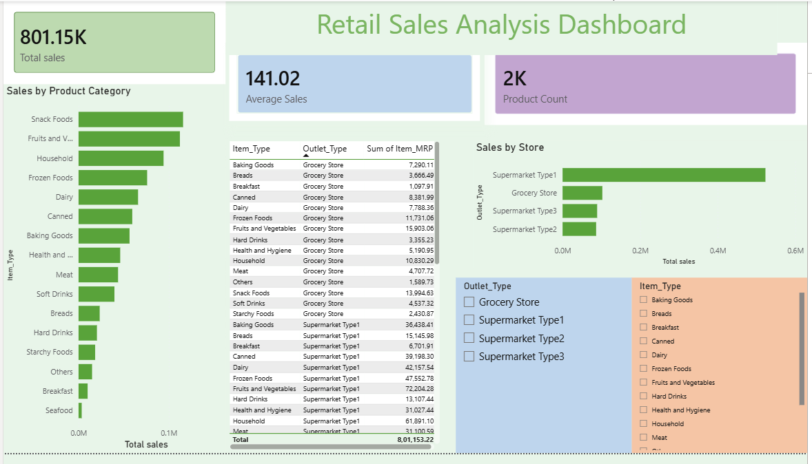

# Retail Sales Analysis Dashboard

## Project Overview

This project is an interactive Power BI dashboard developed to analyze retail sales performance using the Big Mart Sales dataset. The dashboard provides valuable insights into sales trends, product categories, outlet performance, and key business metrics through effective data visualization techniques.

## Dashboard Preview



## Key Performance Indicators (KPIs)

- Total Sales: 801.15K
- Average Sales: 141.02
- Product Count: 2K

## Features

- Sales Analysis by Product Category
- Sales Analysis by Store Type
- KPI Cards for Business Metrics
- Interactive Filters and Slicers
- Detailed Sales Data Table
- Dynamic Data Visualization
- User-Friendly Dashboard Design

## Dataset

The dashboard is built using the Big Mart Sales dataset, which contains information related to:

- Product Categories
- Item Types
- Outlet Types
- Sales Performance
- Product Pricing
- Store Information

## Tools and Technologies Used

- Power BI
- DAX (Data Analysis Expressions)
- Data Modeling
- Data Cleaning
- Data Visualization
- Business Intelligence

## Skills Demonstrated

- Data Analysis
- Dashboard Development
- KPI Creation
- Data Transformation
- Interactive Reporting
- Business Intelligence Reporting
- Data Visualization Design

## Dashboard Components

### Sales by Product Category
Displays total sales generated by different product categories.

### Sales by Store
Compares sales performance across different outlet types.

### KPI Cards
Highlights important business metrics such as:
- Total Sales
- Average Sales
- Product Count

### Interactive Filters
Allows users to filter data based on:
- Outlet Type
- Item Type

### Sales Table
Provides detailed sales information for further analysis.

## Business Insights

- Identifies top-performing product categories.
- Compares sales across different outlet types.
- Tracks overall retail sales performance.
- Helps support data-driven business decisions.

## Repository Structure

```
Retail-Sales-Dashboard/
│
├── Retail_Sales_Dashboard.pbix
├── Big_Mart_Sales.csv
├── Dashboard_Screenshot.png
└── README.md
```

## How to Use

1. Download the repository.
2. Open `Retail_Sales_Dashboard.pbix` in Power BI Desktop.
3. Explore the dashboard using the available filters and slicers.
4. Analyze sales performance and business insights.

## Author

**Bhavya Mehta**

## Connect

GitHub: https://github.com/bhayvammehta

---

This project was developed as part of my learning journey in Power BI, Data Analytics, and Business Intelligence.
